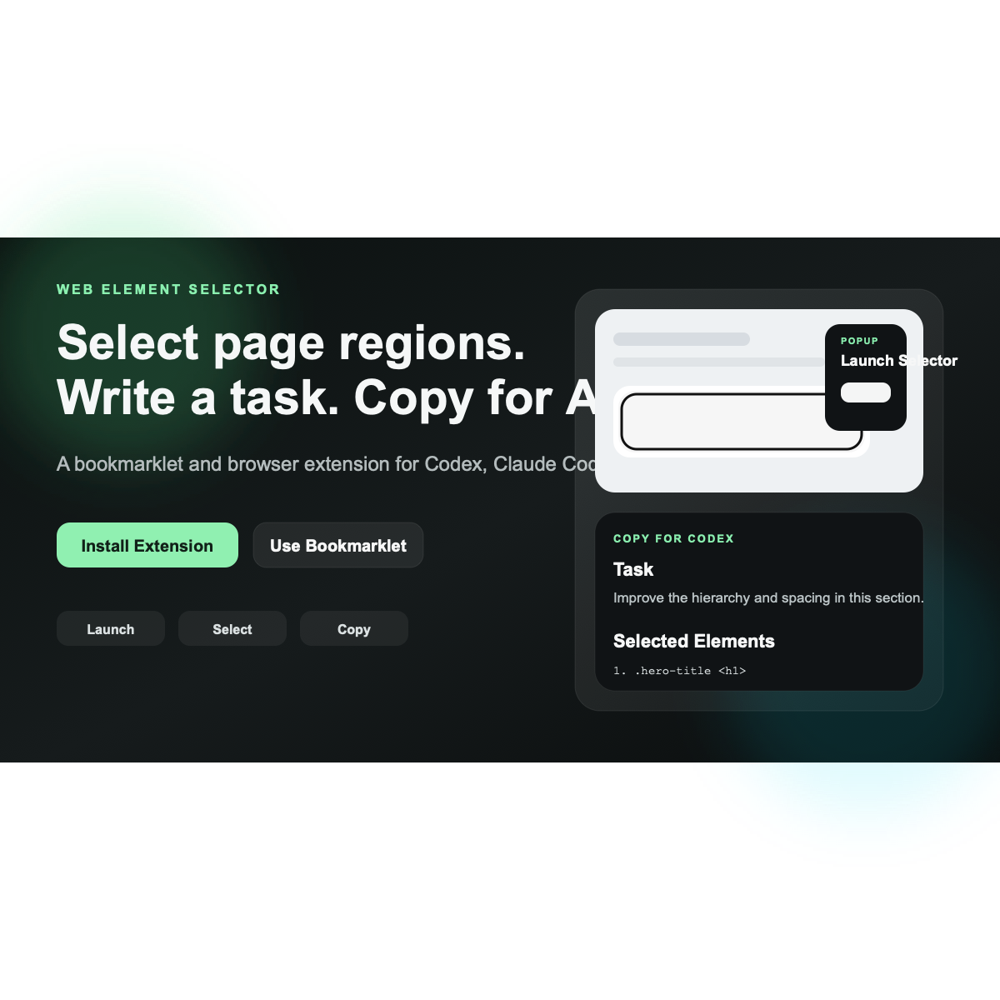

# Web Element Selector

Select page regions. Write a task. Copy a prompt your AI editor can act on.

[](https://github.com/kenchikuliu/web-element-selector/releases/latest)
[](https://kenchikuliu.github.io/web-element-selector/)
[](LICENSE)

<p>
  
</p>

<p>
  <a href="https://github.com/kenchikuliu/web-element-selector/releases/latest"></a>
</p>

Web Element Selector is a bookmarklet and Chrome/Edge extension for AI-assisted UI editing. Launch it on any page, click the exact area you want to change, describe the improvement, and copy a structured prompt for Codex, Claude Code, Cursor, or another coding assistant.

## Why it converts

- It removes the vague part of UI iteration. You point at the exact DOM region instead of describing “the card near the top”.
- It preserves implementation context. The copied output includes selectors, nearby structure, and source hints when available.
- It works in the workflows people already use: local dev pages, staging URLs, bookmarklets, and unpacked extensions.

## Start here

### Install the extension

1. Open `chrome://extensions` or `edge://extensions`
2. Turn on `Developer mode`
3. Click `Load unpacked`
4. Select this folder: `web-element-selector`
5. Pin `Web Element Selector`
6. Click the extension icon and press `Launch Selector`

### Or use the bookmarklet

1. Open `https://kenchikuliu.github.io/web-element-selector/`
2. Drag `Web Element Selector` to your bookmarks bar
3. Open any page and click the bookmark

### Download the packaged build

- Latest release: `https://github.com/kenchikuliu/web-element-selector/releases/latest`
- Current packaged zip: [`dist/web-element-selector-v1.8.0.zip`](dist/web-element-selector-v1.8.0.zip)

## 3-step workflow

### 1. Launch

Open the popup from the extension icon and launch Selector on the current tab.

<p>
  
</p>

### 2. Select

Click the exact UI block you want to change. Multi-select and keyboard navigation are built in.

<p>
  
</p>

### 3. Copy

Write a task, choose the output mode, and copy a prompt formatted for your coding assistant.

<p>
  
</p>

## What you can control

- `Target AI`: `Codex`, `Claude Code`, `Cursor`, `JSON`, or selector-only output
- `Export mode`: `Safe` or `Full`
- `Context mode`: `Focused` or `Nearby`
- Per-element instructions
- Global task text
- Extension-level defaults from the settings page

<p>
  
</p>

## Key interactions

| Action | What it does |
|---|---|
| `Click` | Select an element |
| `Shift + Click` | Add to selection |
| `Drag` | Marquee select multiple elements |
| `↑ / ↓` | Navigate to parent / child element |
| `← / →` | Navigate to previous / next sibling |
| `✎ button` | Add per-element instruction |
| `Task box` | Add one overall request for the selected area |
| `Focused / Nearby` | Control exported container context |
| `Safe / Full` | Control how much page detail gets copied |
| `⌘C / Ctrl+C` | Copy prompt |
| `⌘Z / Ctrl+Z` | Undo the last selection change |
| `Space` | Pause / resume selecting |
| `Esc` | Clear selection |

## Example output

```text
Task
Optimize this area for mobile.

Page Context
- Path: /dashboard
- Target AI: Codex
- Export mode: safe
- Privacy: text, html, and data-* attributes are omitted.

Selected Elements
Use these exact targets when making changes:

1. .hero-title <h1>
   selector: body > main > section > h1
   nearby: section "Dashboard hero" (body > main > section)
   source: src/components/Hero.tsx:12
   react: Layout › Hero
   classes: hero-title
   instruction: Make this red and larger
```

## Privacy

`Safe` mode is the default because copied prompts often get pasted into third-party AI tools. Use `Full` only when you intentionally want to include visible text, truncated HTML, and `data-*` attributes from the page.

The `Snapshot` export is best-effort. It generates an SVG preview of the selected elements and works best on ordinary DOM content without cross-origin assets.

## How it works

The bookmarklet injects `editor.css` and `editor.js` into the current page. The extension uses `chrome.scripting` to inject the same picker. Everything runs client-side. No page data is sent anywhere.

## Development

```bash
git clone https://github.com/kenchikuliu/web-element-selector.git
cd web-element-selector
# Edit assets/editor.js and assets/editor.css
# Push to main — GitHub Pages auto-deploys
```

## License

MIT
